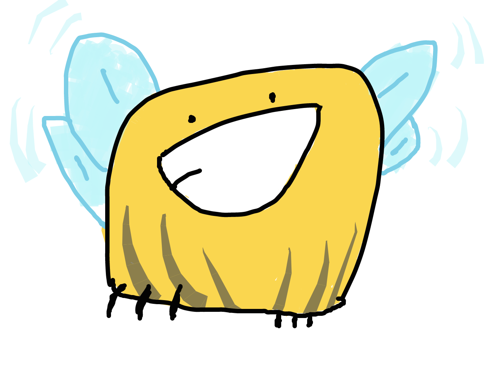

# UGLY BOT



This is a simple discord bot buit to interact with some discord users.

[![forthebadge](data:image/svg+xml;base64,PHN2ZyB4bWxucz0iaHR0cDovL3d3dy53My5vcmcvMjAwMC9zdmciIHdpZHRoPSIyOTQuNTYiIGhlaWdodD0iMzUiIHZpZXdCb3g9IjAgMCAyOTQuNTYgMzUiPjxyZWN0IGNsYXNzPSJzdmdfX3JlY3QiIHg9IjAiIHk9IjAiIHdpZHRoPSIxMDYuMjQiIGhlaWdodD0iMzUiIGZpbGw9IiMzMUM0RjMiLz48cmVjdCBjbGFzcz0ic3ZnX19yZWN0IiB4PSIxMDQuMjQiIHk9IjAiIHdpZHRoPSIxOTAuMzIwMDAwMDAwMDAwMDIiIGhlaWdodD0iMzUiIGZpbGw9IiMzODlBRDUiLz48cGF0aCBjbGFzcz0ic3ZnX190ZXh0IiBkPSJNMTMuOTUgMTguMTlMMTMuOTUgMTguMTlMMTMuOTUgMTcuMzlRMTMuOTUgMTYuMTkgMTQuMzggMTUuMjdRMTQuODAgMTQuMzUgMTUuNjAgMTMuODVRMTYuNDAgMTMuMzUgMTcuNDUgMTMuMzVMMTcuNDUgMTMuMzVRMTguODYgMTMuMzUgMTkuNzMgMTQuMTJRMjAuNTkgMTQuODkgMjAuNzMgMTYuMjlMMjAuNzMgMTYuMjlMMTkuMjUgMTYuMjlRMTkuMTQgMTUuMzcgMTguNzEgMTQuOTZRMTguMjggMTQuNTUgMTcuNDUgMTQuNTVMMTcuNDUgMTQuNTVRMTYuNDggMTQuNTUgMTUuOTcgMTUuMjZRMTUuNDUgMTUuOTYgMTUuNDQgMTcuMzNMMTUuNDQgMTcuMzNMMTUuNDQgMTguMDlRMTUuNDQgMTkuNDcgMTUuOTMgMjAuMjBRMTYuNDMgMjAuOTIgMTcuMzggMjAuOTJMMTcuMzggMjAuOTJRMTguMjUgMjAuOTIgMTguNjkgMjAuNTNRMTkuMTMgMjAuMTQgMTkuMjUgMTkuMjJMMTkuMjUgMTkuMjJMMjAuNzMgMTkuMjJRMjAuNjAgMjAuNTkgMTkuNzIgMjEuMzVRMTguODQgMjIuMTIgMTcuMzggMjIuMTJMMTcuMzggMjIuMTJRMTYuMzYgMjIuMTIgMTUuNTkgMjEuNjNRMTQuODEgMjEuMTUgMTQuMzkgMjAuMjZRMTMuOTcgMTkuMzcgMTMuOTUgMTguMTlaTTI0Ljc3IDE4LjAwTDI0Ljc3IDE4LjAwTDI0Ljc3IDE3LjUyUTI0Ljc3IDE2LjI4IDI1LjIxIDE1LjMyUTI1LjY1IDE0LjM3IDI2LjQ2IDEzLjg2UTI3LjI3IDEzLjM1IDI4LjMxIDEzLjM1UTI5LjM1IDEzLjM1IDMwLjE2IDEzLjg1UTMwLjk2IDE0LjM1IDMxLjQwIDE1LjI5UTMxLjg0IDE2LjIzIDMxLjg1IDE3LjQ4TDMxLjg1IDE3LjQ4TDMxLjg1IDE3Ljk2UTMxLjg1IDE5LjIxIDMxLjQxIDIwLjE2UTMwLjk4IDIxLjEwIDMwLjE4IDIxLjYxUTI5LjM3IDIyLjEyIDI4LjMyIDIyLjEyTDI4LjMyIDIyLjEyUTI3LjI4IDIyLjEyIDI2LjQ3IDIxLjYxUTI1LjY2IDIxLjEwIDI1LjIyIDIwLjE3UTI0Ljc4IDE5LjIzIDI0Ljc3IDE4LjAwWk0yNi4yNSAxNy40NkwyNi4yNSAxNy45NlEyNi4yNSAxOS4zNiAyNi44MCAyMC4xM1EyNy4zNSAyMC45MCAyOC4zMiAyMC45MEwyOC4zMiAyMC45MFEyOS4zMSAyMC45MCAyOS44NCAyMC4xNVEzMC4zNyAxOS40MCAzMC4zNyAxNy45NkwzMC4zNyAxNy45NkwzMC4zNyAxNy41MVEzMC4zNyAxNi4wOSAyOS44MyAxNS4zNFEyOS4yOSAxNC41OCAyOC4zMSAxNC41OEwyOC4zMSAxNC41OFEyNy4zNSAxNC41OCAyNi44MSAxNS4zM1EyNi4yNiAxNi4wOSAyNi4yNSAxNy40NkwyNi4yNSAxNy40NlpNMzcuODAgMjJMMzYuMzEgMjJMMzYuMzEgMTMuNDdMMzcuODAgMTMuNDdMNDEuNjEgMTkuNTRMNDEuNjEgMTMuNDdMNDMuMDggMTMuNDdMNDMuMDggMjJMNDEuNjAgMjJMMzcuODAgMTUuOTVMMzcuODAgMjJaTTQ5LjUwIDE0LjY2TDQ2Ljg3IDE0LjY2TDQ2Ljg3IDEzLjQ3TDUzLjYzIDEzLjQ3TDUzLjYzIDE0LjY2TDUwLjk3IDE0LjY2TDUwLjk3IDIyTDQ5LjUwIDIyTDQ5LjUwIDE0LjY2Wk01OC4xNyAyMkw1Ni42MyAyMkw1OS44NSAxMy40N0w2MS4xOCAxMy40N0w2NC40MSAyMkw2Mi44NiAyMkw2Mi4xNiAyMC4wMUw1OC44NiAyMC4wMUw1OC4xNyAyMlpNNjAuNTEgMTUuMjhMNTkuMjggMTguODJMNjEuNzUgMTguODJMNjAuNTEgMTUuMjhaTTY5LjkzIDIyTDY4LjQ1IDIyTDY4LjQ1IDEzLjQ3TDY5LjkzIDEzLjQ3TDY5LjkzIDIyWk03Ni4yMiAyMkw3NC43NCAyMkw3NC43NCAxMy40N0w3Ni4yMiAxMy40N0w4MC4wNCAxOS41NEw4MC4wNCAxMy40N0w4MS41MSAxMy40N0w4MS41MSAyMkw4MC4wMiAyMkw3Ni4yMiAxNS45NUw3Ni4yMiAyMlpNODUuODEgMTkuNDJMODUuODEgMTkuNDJMODcuMzAgMTkuNDJRODcuMzAgMjAuMTUgODcuNzggMjAuNTVRODguMjYgMjAuOTUgODkuMTUgMjAuOTVMODkuMTUgMjAuOTVRODkuOTMgMjAuOTUgOTAuMzIgMjAuNjNROTAuNzEgMjAuMzIgOTAuNzEgMTkuODBMOTAuNzEgMTkuODBROTAuNzEgMTkuMjQgOTAuMzEgMTguOTRRODkuOTEgMTguNjMgODguODggMTguMzJRODcuODUgMTguMDEgODcuMjQgMTcuNjNMODcuMjQgMTcuNjNRODYuMDggMTYuOTAgODYuMDggMTUuNzJMODYuMDggMTUuNzJRODYuMDggMTQuNjkgODYuOTIgMTQuMDJRODcuNzYgMTMuMzUgODkuMTAgMTMuMzVMODkuMTAgMTMuMzVRODkuOTkgMTMuMzUgOTAuNjkgMTMuNjhROTEuMzkgMTQuMDEgOTEuNzggMTQuNjFROTIuMTggMTUuMjIgOTIuMTggMTUuOTZMOTIuMTggMTUuOTZMOTAuNzEgMTUuOTZROTAuNzEgMTUuMjkgOTAuMjkgMTQuOTFRODkuODcgMTQuNTQgODkuMDkgMTQuNTRMODkuMDkgMTQuNTRRODguMzYgMTQuNTQgODcuOTYgMTQuODVRODcuNTYgMTUuMTYgODcuNTYgMTUuNzFMODcuNTYgMTUuNzFRODcuNTYgMTYuMTggODcuOTkgMTYuNTBRODguNDMgMTYuODEgODkuNDIgMTcuMTBROTAuNDIgMTcuNDAgOTEuMDIgMTcuNzhROTEuNjMgMTguMTYgOTEuOTEgMTguNjVROTIuMTkgMTkuMTMgOTIuMTkgMTkuNzlMOTIuMTkgMTkuNzlROTIuMTkgMjAuODYgOTEuMzcgMjEuNDlROTAuNTUgMjIuMTIgODkuMTUgMjIuMTJMODkuMTUgMjIuMTJRODguMjMgMjIuMTIgODcuNDUgMjEuNzdRODYuNjcgMjEuNDMgODYuMjQgMjAuODNRODUuODEgMjAuMjIgODUuODEgMTkuNDJaIiBmaWxsPSIjRkZGRkZGIi8+PHBhdGggY2xhc3M9InN2Z19fdGV4dCIgZD0iTTExNy44NCAyMS4yNEwxMTcuODQgMjEuMjRMMTE4LjYyIDE5LjQ5UTExOS4xOCAxOS44NiAxMTkuOTMgMjAuMDlRMTIwLjY3IDIwLjMyIDEyMS4zOSAyMC4zMkwxMjEuMzkgMjAuMzJRMTIyLjc2IDIwLjMyIDEyMi43NiAxOS42NEwxMjIuNzYgMTkuNjRRMTIyLjc2IDE5LjI4IDEyMi4zNyAxOS4xMVExMjEuOTggMTguOTMgMTIxLjEyIDE4Ljc0TDEyMS4xMiAxOC43NFExMjAuMTcgMTguNTMgMTE5LjUzIDE4LjMwUTExOC45MCAxOC4wNiAxMTguNDQgMTcuNTVRMTE3Ljk5IDE3LjAzIDExNy45OSAxNi4xNkwxMTcuOTkgMTYuMTZRMTE3Ljk5IDE1LjM5IDExOC40MSAxNC43N1ExMTguODMgMTQuMTUgMTE5LjY2IDEzLjc5UTEyMC41MCAxMy40MyAxMjEuNzAgMTMuNDNMMTIxLjcwIDEzLjQzUTEyMi41MyAxMy40MyAxMjMuMzQgMTMuNjJRMTI0LjE0IDEzLjgwIDEyNC43NiAxNC4xN0wxMjQuNzYgMTQuMTdMMTI0LjAyIDE1LjkzUTEyMi44MiAxNS4yOCAxMjEuNjkgMTUuMjhMMTIxLjY5IDE1LjI4UTEyMC45OCAxNS4yOCAxMjAuNjYgMTUuNDlRMTIwLjM0IDE1LjcwIDEyMC4zNCAxNi4wNEwxMjAuMzQgMTYuMDRRMTIwLjM0IDE2LjM3IDEyMC43MiAxNi41NFExMjEuMTEgMTYuNzEgMTIxLjk2IDE2Ljg5TDEyMS45NiAxNi44OVExMjIuOTIgMTcuMTAgMTIzLjU1IDE3LjMzUTEyNC4xOCAxNy41NiAxMjQuNjQgMTguMDdRMTI1LjEwIDE4LjU4IDEyNS4xMCAxOS40NkwxMjUuMTAgMTkuNDZRMTI1LjEwIDIwLjIxIDEyNC42OCAyMC44M1ExMjQuMjYgMjEuNDQgMTIzLjQyIDIxLjgwUTEyMi41OCAyMi4xNyAxMjEuMzggMjIuMTdMMTIxLjM4IDIyLjE3UTEyMC4zNiAyMi4xNyAxMTkuNDAgMjEuOTJRMTE4LjQ0IDIxLjY3IDExNy44NCAyMS4yNFpNMTMyLjA2IDIyTDEyOS42OCAyMkwxMjkuNjggMTMuNjBMMTMzLjUyIDEzLjYwUTEzNC42NiAxMy42MCAxMzUuNTAgMTMuOThRMTM2LjM0IDE0LjM1IDEzNi44MCAxNS4wNlExMzcuMjUgMTUuNzYgMTM3LjI1IDE2LjcxTDEzNy4yNSAxNi43MVExMzcuMjUgMTcuNjYgMTM2LjgwIDE4LjM1UTEzNi4zNCAxOS4wNSAxMzUuNTAgMTkuNDJRMTM0LjY2IDE5LjgwIDEzMy41MiAxOS44MEwxMzMuNTIgMTkuODBMMTMyLjA2IDE5LjgwTDEzMi4wNiAyMlpNMTMyLjA2IDE1LjQ3TDEzMi4wNiAxNy45M0wxMzMuMzggMTcuOTNRMTM0LjExIDE3LjkzIDEzNC40OCAxNy42MVExMzQuODUgMTcuMjkgMTM0Ljg1IDE2LjcxTDEzNC44NSAxNi43MVExMzQuODUgMTYuMTIgMTM0LjQ4IDE1LjgwUTEzNC4xMSAxNS40NyAxMzMuMzggMTUuNDdMMTMzLjM4IDE1LjQ3TDEzMi4wNiAxNS40N1pNMTQzLjQyIDIyTDE0MS4wMCAyMkwxNDQuNzEgMTMuNjBMMTQ3LjA1IDEzLjYwTDE1MC43NyAyMkwxNDguMzAgMjJMMTQ3LjY0IDIwLjM3TDE0NC4wOSAyMC4zN0wxNDMuNDIgMjJaTTE0NS44NiAxNS45M0wxNDQuNzggMTguNjFMMTQ2Ljk0IDE4LjYxTDE0NS44NiAxNS45M1pNMTU0LjQ5IDE3LjgwTDE1NC40OSAxNy44MFExNTQuNDkgMTYuNTQgMTU1LjA5IDE1LjU0UTE1NS42OSAxNC41NSAxNTYuNzYgMTMuOTlRMTU3LjgzIDEzLjQzIDE1OS4xNyAxMy40M0wxNTkuMTcgMTMuNDNRMTYwLjM1IDEzLjQzIDE2MS4yOCAxMy44M1ExNjIuMjIgMTQuMjIgMTYyLjg0IDE0Ljk3TDE2Mi44NCAxNC45N0wxNjEuMzMgMTYuMzNRMTYwLjQ5IDE1LjQwIDE1OS4zMSAxNS40MEwxNTkuMzEgMTUuNDBRMTU5LjMwIDE1LjQwIDE1OS4yOSAxNS40MEwxNTkuMjkgMTUuNDBRMTU4LjIxIDE1LjQwIDE1Ny41NSAxNi4wNlExNTYuODkgMTYuNzEgMTU2Ljg5IDE3LjgwTDE1Ni44OSAxNy44MFExNTYuODkgMTguNTAgMTU3LjE5IDE5LjA0UTE1Ny40OSAxOS41OSAxNTguMDMgMTkuODlRMTU4LjU3IDIwLjIwIDE1OS4yNyAyMC4yMEwxNTkuMjcgMjAuMjBRMTU5Ljk1IDIwLjIwIDE2MC41NSAxOS45M0wxNjAuNTUgMTkuOTNMMTYwLjU1IDE3LjYyTDE2Mi42NSAxNy42MkwxNjIuNjUgMjEuMTBRMTYxLjkzIDIxLjYxIDE2MC45OSAyMS44OVExNjAuMDYgMjIuMTcgMTU5LjEyIDIyLjE3TDE1OS4xMiAyMi4xN1ExNTcuODAgMjIuMTcgMTU2Ljc1IDIxLjYxUTE1NS42OSAyMS4wNSAxNTUuMDkgMjAuMDVRMTU0LjQ5IDE5LjA2IDE1NC40OSAxNy44MFpNMTc0LjM4IDIyTDE2Ny42NCAyMkwxNjcuNjQgMTMuNjBMMTc0LjIzIDEzLjYwTDE3NC4yMyAxNS40NEwxNzAuMDAgMTUuNDRMMTcwLjAwIDE2Ljg1TDE3My43MyAxNi44NUwxNzMuNzMgMTguNjNMMTcwLjAwIDE4LjYzTDE3MC4wMCAyMC4xN0wxNzQuMzggMjAuMTdMMTc0LjM4IDIyWk0xODAuOTggMTUuNDhMMTc4LjQwIDE1LjQ4TDE3OC40MCAxMy42MEwxODUuOTIgMTMuNjBMMTg1LjkyIDE1LjQ4TDE4My4zNiAxNS40OEwxODMuMzYgMjJMMTgwLjk4IDIyTDE4MC45OCAxNS40OFpNMTkyLjA5IDE1LjQ4TDE4OS41MCAxNS40OEwxODkuNTAgMTMuNjBMMTk3LjAzIDEzLjYwTDE5Ny4wMyAxNS40OEwxOTQuNDYgMTUuNDhMMTk0LjQ2IDIyTDE5Mi4wOSAyMkwxOTIuMDkgMTUuNDhaTTIwMy43OCAyMkwyMDEuNDAgMjJMMjAxLjQwIDEzLjYwTDIwMy43OCAxMy42MEwyMDMuNzggMTYuNzZMMjA3LjAyIDE2Ljc2TDIwNy4wMiAxMy42MEwyMDkuMzkgMTMuNjBMMjA5LjM5IDIyTDIwNy4wMiAyMkwyMDcuMDIgMTguNzJMMjAzLjc4IDE4LjcyTDIwMy43OCAyMlpNMjE2LjkzIDIyTDIxNC41NSAyMkwyMTQuNTUgMTMuNjBMMjE2LjkzIDEzLjYwTDIxNi45MyAyMlpNMjM1LjYyIDE3LjgwTDIzNS42MiAxNy44MFEyMzUuNjIgMTYuNTQgMjM2LjIyIDE1LjU0UTIzNi44MiAxNC41NSAyMzcuODcgMTMuOTlRMjM4LjkyIDEzLjQzIDI0MC4yNCAxMy40M0wyNDAuMjQgMTMuNDNRMjQxLjM5IDEzLjQzIDI0Mi4zMiAxMy44NFEyNDMuMjQgMTQuMjUgMjQzLjg1IDE1LjAyTDI0My44NSAxNS4wMkwyNDIuMzQgMTYuMzlRMjQxLjUzIDE1LjQwIDI0MC4zNiAxNS40MEwyNDAuMzYgMTUuNDBRMjM5LjY4IDE1LjQwIDIzOS4xNCAxNS43MFEyMzguNjEgMTYgMjM4LjMxIDE2LjU0UTIzOC4wMiAxNy4wOSAyMzguMDIgMTcuODBMMjM4LjAyIDE3LjgwUTIzOC4wMiAxOC41MSAyMzguMzEgMTkuMDVRMjM4LjYxIDE5LjYwIDIzOS4xNCAxOS45MFEyMzkuNjggMjAuMjAgMjQwLjM2IDIwLjIwTDI0MC4zNiAyMC4yMFEyNDEuNTMgMjAuMjAgMjQyLjM0IDE5LjIyTDI0Mi4zNCAxOS4yMkwyNDMuODUgMjAuNThRMjQzLjI0IDIxLjM1IDI0Mi4zMiAyMS43NlEyNDEuMzkgMjIuMTcgMjQwLjI0IDIyLjE3TDI0MC4yNCAyMi4xN1EyMzguOTIgMjIuMTcgMjM3Ljg3IDIxLjYxUTIzNi44MiAyMS4wNSAyMzYuMjIgMjAuMDVRMjM1LjYyIDE5LjA2IDIzNS42MiAxNy44MFpNMjQ3Ljk2IDE3LjgwTDI0Ny45NiAxNy44MFEyNDcuOTYgMTYuNTUgMjQ4LjU2IDE1LjU1UTI0OS4xNyAxNC41NiAyNTAuMjMgMTQuMDBRMjUxLjMwIDEzLjQzIDI1Mi42MyAxMy40M0wyNTIuNjMgMTMuNDNRMjUzLjk2IDEzLjQzIDI1NS4wMiAxNC4wMFEyNTYuMDggMTQuNTYgMjU2LjY5IDE1LjU1UTI1Ny4zMCAxNi41NSAyNTcuMzAgMTcuODBMMjU3LjMwIDE3LjgwUTI1Ny4zMCAxOS4wNSAyNTYuNjkgMjAuMDRRMjU2LjA4IDIxLjA0IDI1NS4wMiAyMS42MFEyNTMuOTYgMjIuMTcgMjUyLjYzIDIyLjE3TDI1Mi42MyAyMi4xN1EyNTEuMzAgMjIuMTcgMjUwLjIzIDIxLjYwUTI0OS4xNyAyMS4wNCAyNDguNTYgMjAuMDRRMjQ3Ljk2IDE5LjA1IDI0Ny45NiAxNy44MFpNMjUwLjM2IDE3LjgwTDI1MC4zNiAxNy44MFEyNTAuMzYgMTguNTEgMjUwLjY2IDE5LjA1UTI1MC45NiAxOS42MCAyNTEuNDggMTkuOTBRMjUxLjk5IDIwLjIwIDI1Mi42MyAyMC4yMEwyNTIuNjMgMjAuMjBRMjUzLjI2IDIwLjIwIDI1My43OCAxOS45MFEyNTQuMzAgMTkuNjAgMjU0LjU5IDE5LjA1UTI1NC44OSAxOC41MSAyNTQuODkgMTcuODBMMjU0Ljg5IDE3LjgwUTI1NC44OSAxNy4wOSAyNTQuNTkgMTYuNTRRMjU0LjMwIDE2IDI1My43OCAxNS43MFEyNTMuMjYgMTUuNDAgMjUyLjYzIDE1LjQwTDI1Mi42MyAxNS40MFEyNTEuOTkgMTUuNDAgMjUxLjQ3IDE1LjcwUTI1MC45NiAxNiAyNTAuNjYgMTYuNTRRMjUwLjM2IDE3LjA5IDI1MC4zNiAxNy44MFpNMjY2LjAwIDIyTDI2Mi4wMiAyMkwyNjIuMDIgMTMuNjBMMjY2LjAwIDEzLjYwUTI2Ny4zOCAxMy42MCAyNjguNDUgMTQuMTJRMjY5LjUxIDE0LjYzIDI3MC4xMCAxNS41OFEyNzAuNjkgMTYuNTMgMjcwLjY5IDE3LjgwTDI3MC42OSAxNy44MFEyNzAuNjkgMTkuMDcgMjcwLjEwIDIwLjAyUTI2OS41MSAyMC45NyAyNjguNDUgMjEuNDhRMjY3LjM4IDIyIDI2Ni4wMCAyMkwyNjYuMDAgMjJaTTI2NC40MCAxNS41MEwyNjQuNDAgMjAuMTBMMjY1LjkwIDIwLjEwUTI2Ni45OCAyMC4xMCAyNjcuNjMgMTkuNDlRMjY4LjI5IDE4Ljg4IDI2OC4yOSAxNy44MEwyNjguMjkgMTcuODBRMjY4LjI5IDE2LjcyIDI2Ny42MyAxNi4xMVEyNjYuOTggMTUuNTAgMjY1LjkwIDE1LjUwTDI2NS45MCAxNS41MEwyNjQuNDAgMTUuNTBaTTI4Mi4xNiAyMkwyNzUuNDIgMjJMMjc1LjQyIDEzLjYwTDI4Mi4wMSAxMy42MEwyODIuMDEgMTUuNDRMMjc3Ljc3IDE1LjQ0TDI3Ny43NyAxNi44NUwyODEuNTEgMTYuODVMMjgxLjUxIDE4LjYzTDI3Ny43NyAxOC42M0wyNzcuNzcgMjAuMTdMMjgyLjE2IDIwLjE3TDI4Mi4xNiAyMloiIGZpbGw9IiNGRkZGRkYiIHg9IjExNy4yNCIvPjwvc3ZnPg==)](https://forthebadge.com)
[](https://forthebadge.com)

## Built using

[![Node][node.js]][node-url]
[![Typescript][typescript]][typescript-url]
[![Pulumi][pulumi]][pulumi-url]
[![AWS][aws]][pulumi-url]

## Test coverage

    

## Architecture


## Prerequisites

- Pulumi installed ([see instructions](https://www.pulumi.com/docs/get-started/aws/begin/)).
- Nodejs 16.x or latest installed [see instructions](https://nodejs.org/en/download/).
- An [AWS account](https://aws.amazon.com/).
- An [Discord account](https://discord.com/).
- A discord bot created on [Discord developer portal](https://discord.com/developers/applications)
- Git installed ([see instructions](https://github.com/git-guides/install-git))


## Configuration

You need to create an environment config in the following way.

```
DISCORD_TOKEN='yourDiscordToken'
DISCORD_PUBLIC_KEY='yourDiscordPublickey'
DISCORD_APPLICATION_ID='yourDiscordApplicationId'
DISCORD_SERVER_ID='yourDiscordServerId'
```

And save it as any or all of the following files within the folder `/environmentConfigs`

```
develop.env
production.env
lambdadevelop.env
```

Your default environment is `develop.env` and default deployed environment would be `lambdadevelop.env`

## Running it locally.

1. Clone this repo using SSH or Github Cli ([guide](https://docs.github.com/en/repositories/creating-and-managing-repositories/cloning-a-repository)).
2. Navigate to the cloned repo/folder(uglyBot) using a terminal or shell and run the following.
3. `npm install`
4. `npm run build`
5. `npm run start`

## Deploying and running it

1.  `cd pulumi`
2.  `npm install`
3.  `pulumi up`
4.  Review and accept the deployment. (note that this will automatically create required services and resources in AWS lambda).
5.  Copy the URL on the output `apiGatewayEndpointUrl` and append it with `discordEvents`. Example: `https://example.execute-api.us-east-1.amazonaws.com/stage/discordEvents` and set the `INTERACTIONS ENDPOINT URL` on your application to the URL you just constructed.
6.  Add your discord bot to one of your servers. (make sure the server ID is the same as the one you specified on Configuration).
7.  Try the command `/info` on your server.

## Test coverage report generation

`npm run coverage`

## Update readme with latest coverage

`npm run updateReadmeCoverage`

## License

Distributed under the MIT License. See LICENSE.txt for more information.

## Contact

Project Owner - [Dasith Kuruppu](https://github.com/DasithKuruppu)

[node.js]: https://img.shields.io/badge/Nodejs-000000?style=for-the-badge&logo=node.js&logoColor=white
[node-url]: https://nodejs.org/
[pulumi]: https://img.shields.io/badge/Pulumi-000000?style=for-the-badge&logo=pulumi&logoColor=white
[pulumi-url]: https://www.pulumi.com/
[aws]: https://img.shields.io/badge/AWS-000000?style=for-the-badge&logo=amazonaws&logoColor=#232F3E
[aws-url]: https://nodejs.org/
[typescript]: https://img.shields.io/badge/Typescript-000000?style=for-the-badge&logo=typescript&logoColor=white
[typescript-url]: https://typescript.org/
